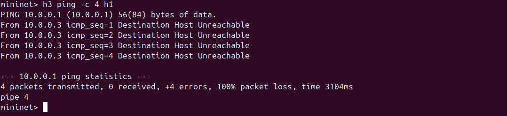

# SDN Based Access Control System

## Problem Statement
Implement an SDN-based access control system using Mininet and Ryu controller that allows only authorized hosts to communicate within the network. Unauthorized hosts are silently blocked using OpenFlow flow rules.

## Objective
- Maintain a whitelist of authorized hosts
- Install allow/deny flow rules dynamically
- Block unauthorized access at the switch level
- Verify access control through testing
- Regression test to verify policy consistency

## Network Topology
h1 (10.0.0.1) ─┐
h2 (10.0.0.2) ─┤
s1 ──── Ryu Controller
h3 (10.0.0.3) ─┤
h4 (10.0.0.4) ─┘

- **h1, h2** — Authorized (whitelisted)
- **h3, h4** — Unauthorized (blocked)

## Screenshots

### 1. Setup & Controller Startup
  


### 2. Ryu Controller Logs
  


### 3. Authorized Communication
  


### 4. Unauthorized Access Blocked
  
  


### 5. Regression Test - Policy Consistency


### 6. Flow Table Verification
  


### 7. Unauthorized iperf Test


## Setup & Installation

### Prerequisites
- Ubuntu 20.04/22.04
- Mininet
- Python 3.9
- Ryu Controller

### Step 1 - Install Mininet
```bash
sudo apt update
sudo apt install mininet -y
```

### Step 2 - Install Ryu
```bash
sudo apt install python3.9 python3.9-venv python3.9-distutils -y
python3.9 -m venv ~/ryu-env39
source ~/ryu-env39/bin/activate
pip install setuptools==58.0.0
pip install eventlet==0.30.2
pip install ryu
```

### Step 3 - Clone Repository
```bash
git clone https://github.com/jashruth-k-a/SDN-Based-Access-Control-System
cd SDN-Based-Access-Control-System
```

## Execution

### Terminal 1 - Start Ryu Controller
```bash
source ~/ryu-env39/bin/activate
ryu-manager access_control.py
```

### Terminal 2 - Start Mininet Topology
```bash
sudo mn -c
sudo python3 topology.py
```

## Test Scenarios

### Scenario 1 - Authorized Communication (h1 ↔ h2)
```bash
h1 ping -c 4 h2
```
Expected: 0% packet loss

### Scenario 2 - Unauthorized Communication (h3 → h1)
```bash
h3 ping -c 4 h1
```
Expected: 100% packet loss

### Scenario 3 - Throughput Test (iperf)
```bash
# Authorized
h2 iperf -s &
h1 iperf -c h2

# Unauthorized
h1 iperf -s &
h3 iperf -c h1 -t 5
```

### Regression Test - Policy Consistency
```bash
h2 ping -c 4 h3   # blocked
h4 ping -c 4 h1   # blocked
h1 ping -c 4 h2   # still allowed
```

## Flow Table
After testing, flow table shows:
- `h1 → h2` = forward to port 2 (ALLOW)
- `h2 → h1` = forward to port 1 (ALLOW)
- `h1 → h3` = drop (BLOCK)
- `h1 → h4` = drop (BLOCK)

## Expected Output
- Authorized hosts (h1, h2) communicate successfully
- Unauthorized hosts (h3, h4) are silently dropped
- Flow rules installed dynamically by controller
- Policy remains consistent across regression tests

## SDN Concepts Demonstrated
- **Controller-Switch interaction** via OpenFlow
- **packet_in event handling** in Ryu
- **Match-Action flow rules** (MAC-based matching)
- **Proactive + Reactive** rule installation
- **Access Control** via whitelist enforcement

## Tools Used
- Mininet — network emulation
- Ryu — SDN controller (OpenFlow 1.3)
- Open vSwitch — virtual switch
- iperf — throughput testing
- ovs-ofctl — flow table inspection

## References
1. Mininet: https://mininet.org/overview/
2. Ryu SDN Framework: https://ryu.readthedocs.io/
3. OpenFlow 1.3 Spec: https://opennetworking.org/
4. Open vSwitch: https://www.openvswitch.org/

## License
[MIT](./LICENSE)

---

Built by [Jashruth K A](https://github.com/jashruth-k-a)