# SDN Based Access Control System

**Dynamic Whitelist-based Access Control using Ryu SDN Controller and Mininet**

---

## Problem Statement
Implement an SDN-based access control system using Mininet and Ryu controller that allows only authorized hosts (h1 & h2) to communicate within the network. Unauthorized hosts (h3 & h4) are silently blocked using dynamic OpenFlow flow rules.

## Objectives
- Maintain a whitelist of authorized hosts (MAC-based)
- Dynamically install allow/deny flow rules on the switch
- Block unauthorized traffic at the data plane (switch) level
- Verify access control and policy consistency through rigorous testing

## Network Topology
```bash
h1 (10.0.0.1) ─┐
h2 (10.0.0.2) ─┤
s1 ──── Ryu Controller
h3 (10.0.0.3) ─┤
h4 (10.0.0.4) ─┘
```

- **Authorized Hosts**: h1 (10.0.0.1), h2 (10.0.0.2)  
- **Unauthorized Hosts**: h3 (10.0.0.3), h4 (10.0.0.4)

---

## Screenshots

### 1. Setup & Controller Startup
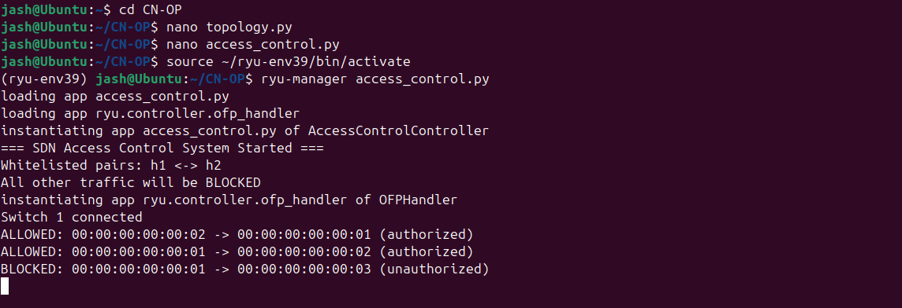  
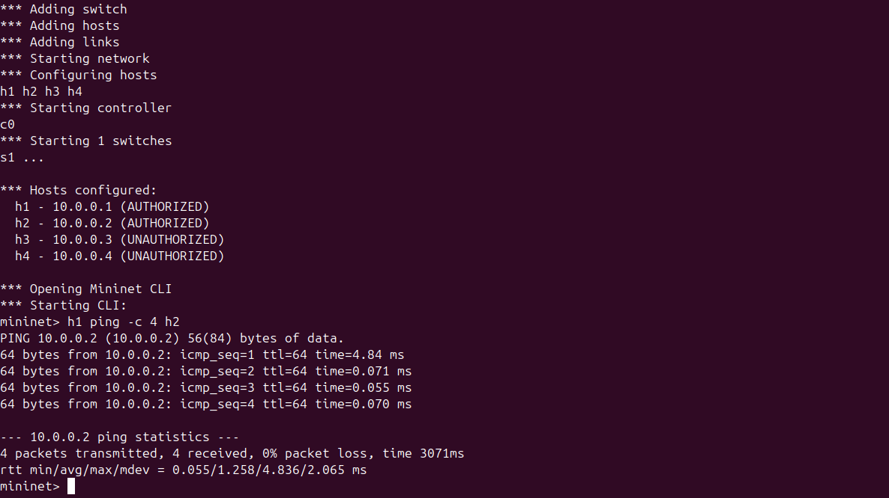

### 2. Ryu Controller Logs
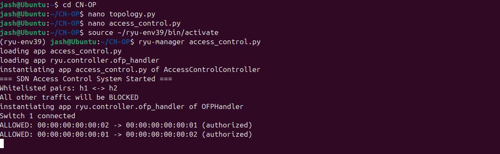  
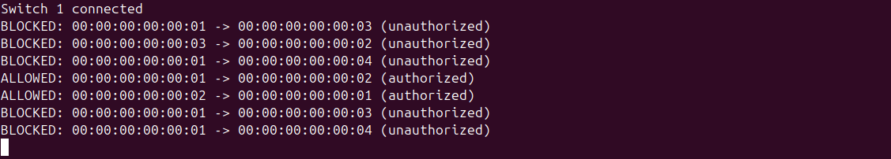

### 3. Authorized Communication
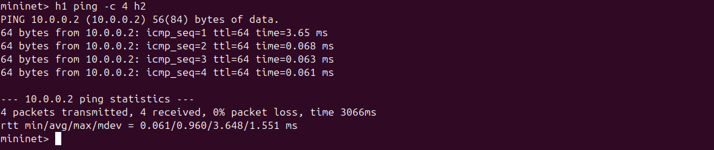  
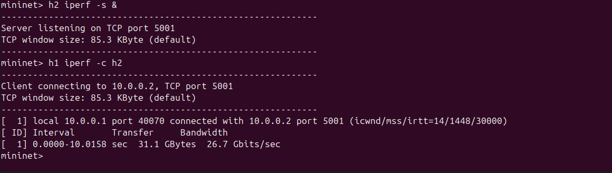

### 4. Unauthorized Access Blocked
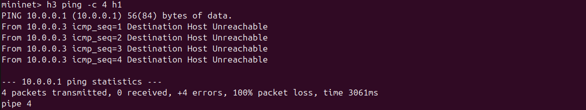  
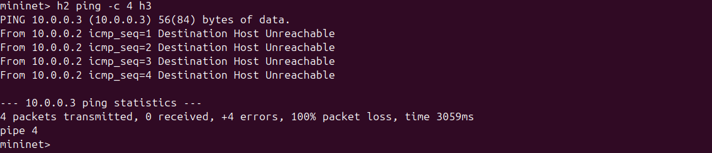

### 5. Regression Test - Policy Consistency
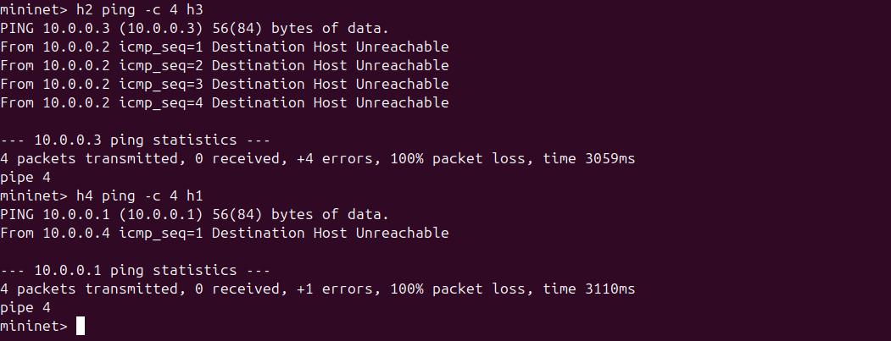

### 6. Flow Table Verification
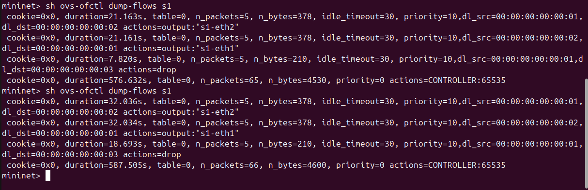  
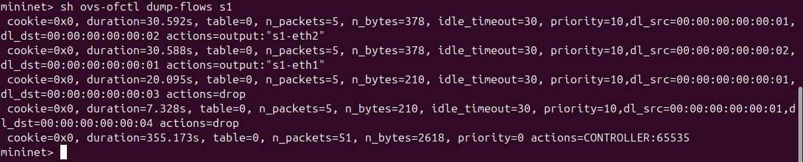

### 7. Unauthorized iperf Test
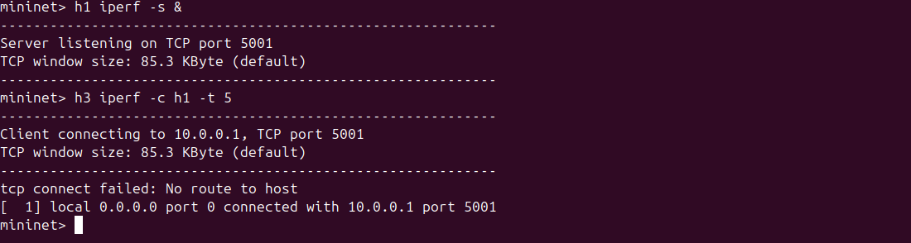

---

## Setup & Installation

### Prerequisites
- Ubuntu 20.04 / 22.04
- Mininet
- Python 3.9
- Ryu Controller

### Step 1 - Install Mininet
```bash
sudo apt update
sudo apt install mininet -y
```

### Step 2 - Install Ryu
```bash
sudo apt install python3.9 python3.9-venv python3.9-distutils -y
python3.9 -m venv ~/ryu-env39
source ~/ryu-env39/bin/activate
pip install setuptools==58.0.0 eventlet==0.30.2 ryu
```
### Step 3 - Clone Repository
```bash
git clone https://github.com/jashruth-k-a/SDN-Based-Access-Control-System
cd SDN-Based-Access-Control-System
```
### Repository Files
```bash
topology.py — Mininet topology and host configuration
access_control.py — Main Ryu SDN Controller application
demo/ — All project screenshots
```

### Execution
```bash 
Terminal 1 — Start Ryu Controller
Bashsource ~/ryu-env39/bin/activate
ryu-manager access_control.py
Terminal 2 — Start Mininet Topology
Bashsudo mn -c
sudo python3 topology.py
```

### Test Scenarios & Results
```bash
Scenario,Command,Expected Result,Status
Authorized Ping,h1 ping -c 4 h2,0% packet loss, Pass
Authorized iperf,h1 iperf -c h2,High bandwidth (~26 Gbps), Pass
Unauthorized Ping,h3 ping -c 4 h1,100% packet loss, Blocked
Unauthorized Cross Traffic,"h2 ping h3, h4 ping h1",100% packet loss, Blocked
Regression Test,Repeated cross pings,Policy remains consistent, Pass
```

### SDN Concepts Demonstrated
```bash
Controller-Switch interaction via OpenFlow 1.3
packet_in event handling in Ryu
Dynamic Match-Action flow rules (MAC-based)
Proactive and Reactive flow installation
Access Control List (ACL) enforcement at switch level
```

### Tools Used
```bash
Mininet — Network Emulation
Ryu — SDN Controller
Open vSwitch
iperf — Throughput Testing
ovs-ofctl — Flow table inspection
```

### References
```bash
Mininet
Ryu Framework
OpenFlow 1.3
```

## License
[MIT](./LICENSE)

---

Built by [Jashruth K A](https://github.com/jashruth-k-a)